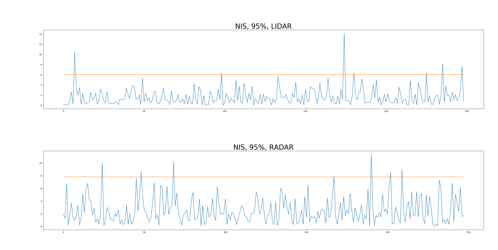

# Udacity Self Driving Car Nanodegree

## Term 2, Project 2 -- Unscented Kalman Filter

### Name: Ciaran Murphy

### Date: 13-Feb-2018

---

## Introduction

The goal of this project is to implement an Unscented Kalman Filter in C++. The
input data simulates Lidar and Radar sensor input to track an object (e.g.
bicycle) moving in a figure-of-eight pattern around the car. This input sensor
data is fed to the Kalman Filter implementation over a TCP socket and the
program then calculates an estimate of the location of the object.

In this write up, I will cover the points of the project
[rubric](https://review.udacity.com/#!/rubrics/783/view). 


## Compiling

* **Requirement**: *Your code should compile.*

The code can be compiled with no errors or warnings using the provided cmake
file in the project root directory. To compile, move to the root dir of the
project and execute:

```shell
mkdir build && cd build
cmake ..
make

```

This will create a file called `UnscentedKF` which is the main executable of the
program.


## Accuracy

* **Requirement**: *px, py, vx, and vy RMSE should be less than or equal to the values [.09, .10, .40, .30]*

The final RMSE values for the implementation were as follows: 

|Item | RMSE |
|-|------|
|px|0.0770|
|py|0.0882|
|vx|0.3847|
|vy|0.2929|


## Follows the Correct Algorithm

* **Requirement**: *The Sensor Fusion algorithm follows the general processing flow as taught*

The implementation follows the lessons closely with most of the code taken
directly from the programming exercises. 


* **Requirement**: *The Kalman Filter algorithm handles the first measurements appropriately*

In the method `UKF::ProcessMeasurement` of `ukf.cpp` line number 97
starts a section to deal with the initial incoming measurements. 

* **Requriement**: *The Kalman Filter algorithm first predicts then updates*

The code in `ukf.cpp` starts the prediction step before it starts the update step.

* **Requirement**: *The Kalman Filter can handle radar and lidar measurements*

The code in the provided `main.cpp` file contains the parsing logic that
detects whether the incoming line item is Radar or Lidar data by checking the
1st char in the line (either an 'R' or an 'L'). A `measurement_pack` object is
then populated and the data sent on to `ukf.cpp` for processing. Further code 
then splits between Lidar and Radar data and triggers the code sections that 
set up the relevant matrices.

## Code Efficiency

* **Requirement**: *The algorithm should avoid unnecessary calculations*

The code is efficient and avoids unnecessary cycles while attempting to
be as readable as possible. 

## NIS Checks

The plot below shows the NIS calculations for both LIDAR and RADAR during the
data processing with a horizontal line showing the 95th percentile position. As
can be seen, the data is mostly below the 95% line with a few points going
above which demonstrates the correct behavior of the Unscented Kalman Filter.




